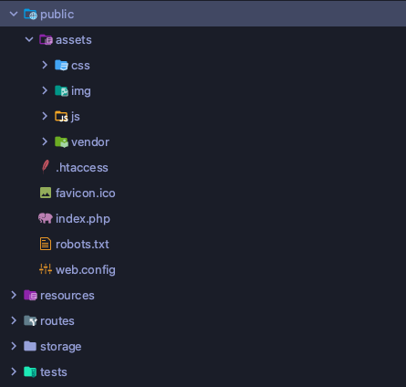

## Install Laravel 8

Langkah pertama seperti biasa install dulu laravel 8 jalankan perintah berikut ke terminal anda.

```bash
laravel new landing-laura
``` 

Jangan lupa install dependency nodejs nya

```bash
npm install
``` 


Tidak perlu melakukan setup database untuk saat ini karena website yang akan dibuat pada kasus ini belum perlu koneksi database.

Untuk project kali ini kita perlu memperhatikan folder apa saja yang ada di laravel dan untuk apa fungsi dari masing masing folder tersebut detail dari fungsi folder pada laravel ada di [Dokumentasi Laravel](https://laravel.com/docs/8.x/structure)

### Folder Public 

Pada project ini kita perlu memperhatikan dua folder yaitu folder public dan folder resource, keduanya adalah tempat untuk menyimpan file css dan js serta view. Perbedaannya adalah folder public menyimpan file css dan js yang siap digunakan untuk production (file css dan js yang siap pakai, yang sudah di minifiy dan di optimasi) selain file css dan js file gambar yang dibutuhkan oleh website juga ditaruh di folder ini. Semua file yang ada di folder public dapat diakses langsung secara public melalui browser.

### Folder Resource

Sedangkan folder resource adalah tempat kita menyimpan file css dan js yang dalam proses development (belum di kompilasi / di optimasi) di folder resource ini juga akan kita simpan file view laravel. File yang ada di folder resource tidak dapat diakses secara public.

## Cek Template

Langkah selanjutnya adalah memeriksa asset template html yang diberikan, biasanya setiap template html menggunakan rule dan gaya penulisan sendiri yang harus kita sesuaikan dengan struktur folder di laravel. Kebetulan template yang akan digunakan ini sudah cukup baik dengan menyimpan gambar 

### Cek Style Penyusunan Asset
Berikut ini penyusunan asset pada template html laura.


### Cek Style Import Css dan Js
Berikut ini cara import css di template asset html laura.


Berikut ini cara import js di template asset html laura.


Dari sini kita sudah dapat memastikan bahwa folder `asset` template laura dapat langsung di copy paste ke folder `public` dari project laravel. Kenapa hal ini dilakukan karena semua file yang ada di folder `asset` diakses oleh file template html secara langsung berarti file file tersebut harus dapat diakses `public`.

### Pindahin Asset

Dengan struktur template html yang sudah baik seperti ini kita dibuat lebih mudah pada saat memindahkan asset css dan js serta image nya dengan cukup mengcopy dan paste folder asset ke folder publik.



## Buat Route

Setiap aplikasi laravel selalu dimulai dari file routes laravel 8 menyediakan beberapa file routes, yang kali ini kita fokus pada file `web.php` di folder routes.

Bukalah file tersebut dan lihatlah kode routes pertama anda.

```php
Route::get('/', function () {
    return view('welcome');
});
```

## Pindahkan Template Ke Blade
